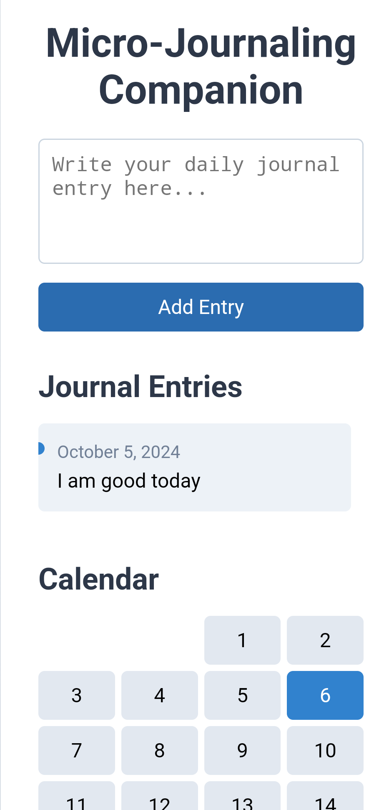

# Micro-Journaling Companion

The **Micro-Journaling Companion** is a minimalist journaling app that allows users to record one-sentence daily entries. With a simple interface and intuitive design, this app encourages daily reflection through micro-journal entries. Over time, users can view their journal entries in a timeline and calendar format, and even export their entries as a text file.

## Project Link
[Micro-Journaling Companion GitHub Repository](https://github.com/yasinULLAH/Micro-journaling-companion)

## Features
- **Daily Micro-Journaling**: Users can submit a one-sentence journal entry every day.
- **Calendar View**: A built-in calendar allows users to visualize their entries for each day. Days with entries are highlighted.
- **Past Entries**: View all past entries in reverse chronological order.
- **Interactive Entries**: Click on any day in the calendar to view, edit, or add a journal entry for that day.
- **Export Entries**: Users can export all their journal entries as a `.txt` file for personal reflection or archival.
- **Data Persistence**: All journal entries are saved in `localStorage`, so users’ entries are retained even after refreshing the browser or closing the app.

## Technologies Used
- **HTML**: Structuring the webpage.
- **CSS**: Styling and layout.
- **JavaScript**: Logic for handling journal entries, `localStorage` integration, and generating the calendar.

## Installation & Usage
To use the **Micro-Journaling Companion** locally:

1. **Clone the Repository:**
    ```bash
    git clone https://github.com/yasinULLAH/Micro-journaling-companion.git
    ```
2. **Navigate to the Project Folder:**
    ```bash
    cd Micro-journaling-companion
    ```
3. **Open `index.html` in Your Browser:**
    - You can simply double-click the `index.html` file to open the app in your browser.
    - Alternatively, you can run it on a local server for a more enhanced experience.

## How to Use
1. **Add a Journal Entry**: 
    - Use the text area at the top to write your daily micro-journal entry.
    - Click the **"Add Entry"** button to save it for today.
  
2. **View Past Entries**:
    - Below the text area, you’ll find a list of your previous journal entries, sorted by date.

3. **Use the Calendar**:
    - The calendar displays the current month. Days with saved entries are highlighted.
    - Click any day on the calendar to view, add, or edit the journal entry for that day.

4. **Export Your Entries**:
    - Click the **"Export as TXT"** button to download all your journal entries as a `.txt` file.

## Screenshots



## Contributing
Contributions are welcome! Here’s how you can contribute to the project:

1. Fork the repository.
2. Create a new branch:
    ```bash
    git checkout -b feature/YourFeatureName
    ```
3. Make your changes and commit them:
    ```bash
    git commit -m "Add your message here"
    ```
4. Push your changes:
    ```bash
    git push origin feature/YourFeatureName
    ```
5. Open a pull request.

## License
This project is open-source and available under the [MIT License](LICENSE).

## Contact
For any issues, suggestions, or questions, feel free to open an issue on the [GitHub repository](https://github.com/yasinULLAH/Micro-journaling-companion).

---

Happy Journaling! 📔✨
